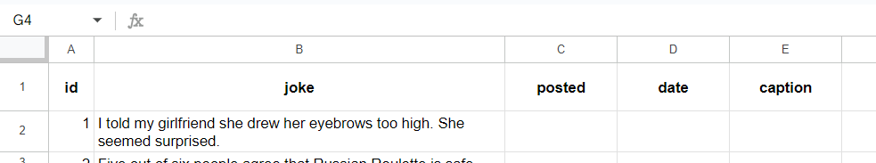

# jokes module

## About
Module that is capable of publishing a new insta-post with jokes every day.  
Fetches stored jokes in google-sheets, writes into an image and then posts it.


----
## Used 

1. **Google service account**: Used for authentication during accessing, editing google sheets.
2. **gspread**: Python package for working with google-sheets.
3. **instagrapi**: Python library for working with Instagram.

----
## How to use

### Required things:
#### Google
1. **google account** and a **spreadsheet** named "jokes" which in itself has a worksheet named "jokes". (These default names can be changed in `constants.py`). The spreadsheet should have columns like this:

2. **Google project**: Via this we get google service account. Create a new project(or use old one) at [Google Cloud Platform](https://console.cloud.google.com/). Inside the project **enable Google Sheet API and Google Drive API**(Just use search bar on top).
2. **Google service account**: Inside google project [create service account](https://cloud.google.com/iam/docs/service-accounts-create). Then generate **key** for that service account, option to **download as json** will be available. 
3. Each google-service-account is given a unique **service-account-email** like: _service-account-name@project-name.iam.gserviceaccount.com_. **Share the jokes spreadsheet**(from point 1) to this email account.

#### Instagram
1. **Instagram account**

### Set up
1. Google service account key:
Just turn downloaded json into `gservice_account_key.py`, and modify its content to look like:
```python
GSERVICE_ACC_KEY = {
  "type": "xxxx",
  "project_id": "xxxx",
  "private_key_id": "xxxx",
  "private_key": "xxxx",
  "client_email": "xxxx",
  "client_id": "xxxx",
  "auth_uri": "xxxx",
  "token_uri": "xxxx",
  "auth_provider_x509_cert_url": "xxxx",
  "client_x509_cert_url": "xxxx",
  "universe_domain": "xxxx"
}
```
Put this python file inside `credentials` folder.

2. Instagram credentials: Inside `credentials` folder create a new python file `insta_credentials.py` with content:
```python
INSTA_CREDS = {
    "username": "email/username",
    "password": "xxxx"
}
```
----
### Running
The `main.py` is set for using this module. Just run:  
`python main.py`  
It would show the result image with joke, and ask whether to proceed for posting or not.  

Typical code snippet to run by yourself:
```python
joke_module = Jokes(
    insta_creds=INSTA_CREDS,
    gsheet_creds=GSERVICE_ACC_KEY,
    gsheet_title="jokes",
    worksheet_title="jokes"
)
joke_module.publish_new_joke()
```

----
#TODO
1. handling emojis

